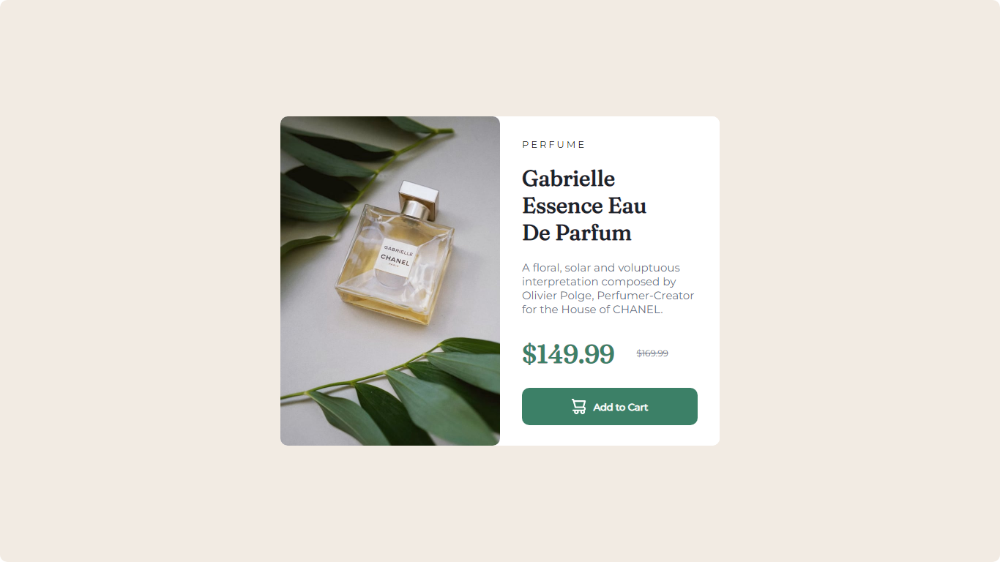

# Frontend Mentor - Solução de componente de cartão de visualização do produto

Esta é uma solução para o [desafio do componente do cartão de visualização do produto no Frontend Mentor](https://www.frontendmentor.io/challenges/product-preview-card-component-GO7UmttRfa). Os desafios do Frontend Mentor ajudam você a melhorar suas habilidades de codificação criando projetos realistas.

## Índice

- [Visão geral](#visão-geral)
  - [O desafio](#the-challenge)
  - [Captura de tela](#captura-de-tela)
  - [Links](#links)
- [Meu processo](#meu-processo)
  - [Construído com](#construído-com)
  - [O que aprendi](#o-que-aprendi)
  - [Desenvolvimento contínuo](#desenvolvimento-contínuo)
  - [Recursos úteis](#useful-resources)
- [Autor](#autor)
- [Agradecimentos](#agradecimentos)

## Visão geral

### O desafio

Os usuários devem ser capazes de:

- Visualize o layout ideal dependendo do tamanho da tela do dispositivo
- Veja os estados de foco e foco para elementos interativos

### Captura de tela



### Links

- URL da solução: [Site da solução](https://www.frontendmentor.io/solutions/responsive-product-preview-card-L6ui1EBPw6)
- URL do site ao vivo: [Site ao vivo](https://byhenriquesilva.github.io/Produto-card/)

## Meu processo

### Construído com

- Marcação HTML5 semântica
- Propriedades personalizadas de CSS
- Flexbox

### O que eu aprendi

Neste projeto foi melhorado as habilidades de css, tendo ênfase na propriedade flex e em como deixar uma página responsiva.


``` css
@media screen and (max-width :580px){
  .conteiner{
      flex-direction: column;
      justify-content: center;
      align-items: center;   
  }
  .text{
    width: 300px;
  }
  body{
    height: 970px;
    background-color: hsl(0, 0%, 100%);
  }
  .icon{
    border-radius: 0px;
  }
}
```

### Desenvolvimento contínuo

Para desenvolvimento contínuo pretendo continuar aperfeiçoando meus conhecimentos em css e começar a estudar JavaScript.

### Recursos úteis

- [Cores](https://convertingcolors.com/hsl-color-228_12_50.html) - Isso me ajudou a selecionar as cores corretas. Gostei muito deste modelo e vou usá-lo daqui para frente.

## Autor

- Site - [Henrique Silva](https://profilehs.netlify.app/)
- Mentor de frontend - [@byhenriquesilva](https://www.frontendmentor.io/profile/byhenriquesilva)
- Github - [@byhenriquesilva](https://github.com/byhenriquesilva)

## Agradecimentos

Agradecer primeiramente a Deus, agradecer a Frontend Mentor por essa oportunidade de praticar e melhorar minnhas habilidades e agradecer a todos que me ejudaram e me apoiaram na  construção desse projeto.
